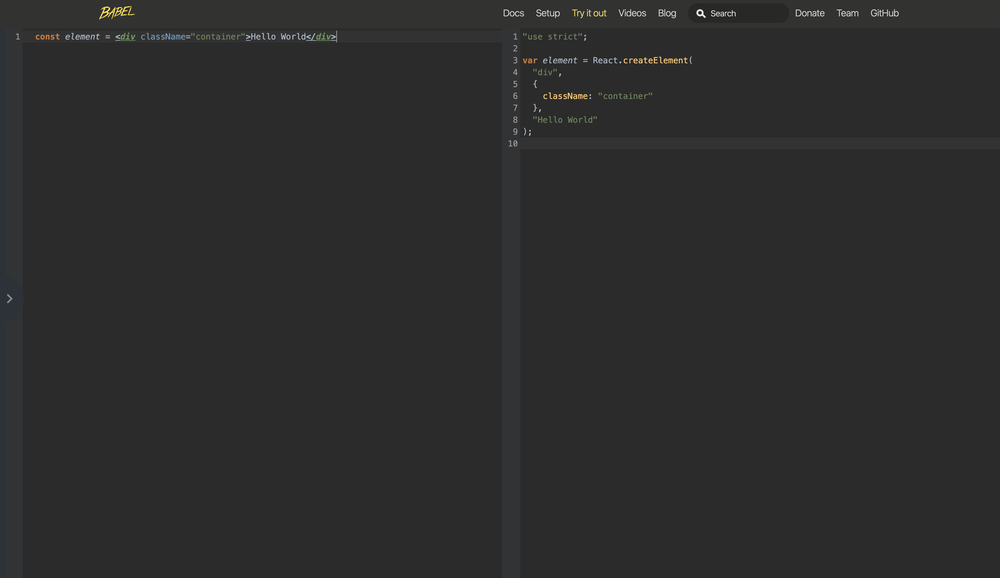

# Create a User Interface with React’s JSX syntax

#### [📹 Video]()

#### [💻 CodeSandbox](https://codesandbox.io/s/github/kentcdodds/beginners-guide-to-react/tree/codesandbox/03-jsx?from-embed)

# Notes

- React team came up with JSX. It’s an extension to the JavaScript language to support syntax that looks similar to the HTML that you would write to create these DOM elements (there are a handful of differences).
- JSX gives us an expressive syntax for representing our UI, without losing the benefits and powers of writing our UI in JavaScript.
- The best way to take advantage of this is to learn how JSX is compiled to regular JavaScript. By default the browser does not compile JSX, it needs [Babel](https://babeljs.io) to compile non-standard features, like JSX.
- **Tip**: Spend some time exploring how Babel compiles JSX, this will help you be more effective when using JSX.
- [Example](https://babeljs.io/repl#?browsers=&build=&builtIns=false&spec=false&loose=false&code_lz=ATDGHsDsGcBdgKYBsEFsGXgXmAHgCYCWAbmEgIbTQBy56WARBJuYZAgE4MB8AEsknDAA6uA5J8uAPRFi3IA&debug=false&forceAllTransforms=false&shippedProposals=false&circleciRepo=&evaluate=false&fileSize=false&timeTravel=false&sourceType=module&lineWrap=false&presets=es2015%2Creact%2Cstage-2&prettier=true&targets=&version=7.8.7&externalPlugins=):



- Use Babel in the browser, by adding a `script` tag to `babel/standalone` and adding a new tag with `type='text/babel'`;

```html
<script src="https://unpkg.com/@babel/standalone@7.8.3/babel.js"></script>
```

This will add a new script with our new code compiled by Babel. In a production environment, it's not recommended that you use babel/standalone.

## Additional resource
- [What is Babel?](https://babeljs.io/docs/en/)
- [Configure babel for React with preset-react](https://egghead.io/lessons/react-configure-babel-for-react-with-preset-react)
